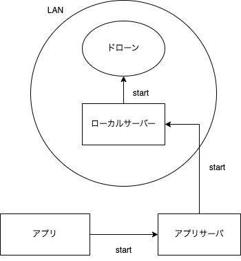
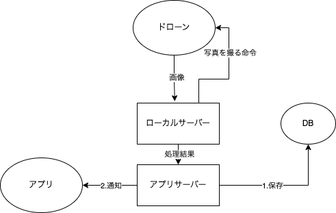
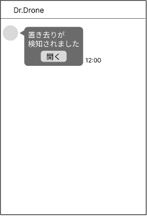
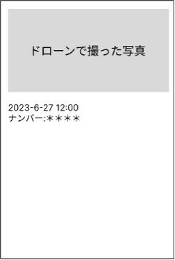
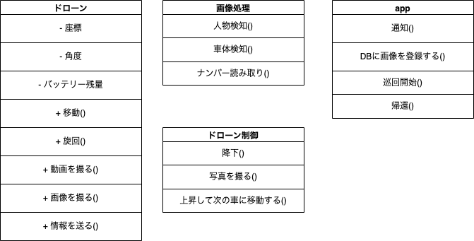
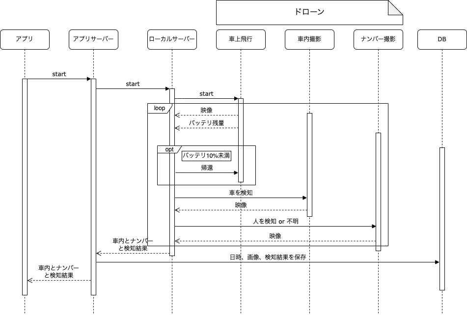

# ③ システム設計書
「Dr. Drone」

6 ・ Delicious Meal

代表者氏名：渡邊湊至　

- [③ システム設計書](#-システム設計書)
  - [企画概要](#企画概要)
    - [背景・動機](#背景動機)
    - [目的](#目的)
    - [既存システム等の問題点](#既存システム等の問題点)
    - [解決方法](#解決方法)
  - [システム](#システム)
    - [要件定義](#要件定義)
    - [基本設計](#基本設計)
      - [システム構成](#システム構成)
      - [警備員が使う画面の遷移図](#警備員が使う画面の遷移図)
  - [評価](#評価)

## 企画概要

### 背景・動機
（現状に対して課題点や理想像とのギャップなどを記載する）

` `最近、車内で子供が置き去りにされる事例が増えているという問題がある。車内に置き去りにする要因としては、一時的な時間なら問題ないと考えて、故意に子供を置き去りにす る、子供の存在を忘れてしまうなど様々なものがある。海外では、車内に置き去り防止装置を義務付けている国もあり、そのような製品も国内で使うことは可能だが、日本ではそのような法整備がないため、車内に取り付けるものは普及しないのではないかと考えた。

### 目的
（背景や動機の状況に対して、改善点や期待する効果を記載する）

・置き去りによる、子供の死亡事故を減らす。

・そもそも置き去りをさせない仕組みにする。

### 既存システム等の問題点
（既存のシステムでは目的を達成できない原因や達成できるシステムが存在しない理由など、なぜ今まで解決できていないのか、また解決しなければならない理由を記載する）

後ろ向き停車など、車内が見えない車に対して、置き去りを検知することができない。

理由)

既存のシステムは、駐車場の通路を巡回するだけで、一台一台を念入りにチェックすることができていない。

### 解決方法
ドローンが駐車場を巡回し、車を一台一台認識する。車内の人物を検知することで、車内放置を店員等に通知する。

探索不可能な車両が発見された場合、店員等の担当に車内の写真と共に通知し、人の確認のダブルチェックを行う。ドローンのみの探索、調査と併せることにより車内放置の検知の精度を確実なものとする。ドローンの認識だけでは判別できない車両は、人員の招集が必要である。

置き去り発見時と探索不可能な車両発見時の通知内容は変えておくことで、店員等担当の混乱を抑えることが出来る。

## システム
### 要件定義
（解決手法を実現するために必要なシステムの概要を記載する）

- システム概要
1. ドローンが駐車場を巡回する。
2. 物体検知で車を一台一台認識し、車内の人物を検知する。
3. 車内が見えない車がある場合、店員等に通知する。
4. 一定時間車内に滞在していた場合、店員等に通知する。
5. 通知の際、車の位置と画像、ナンバーを添付する。
6. 確認後、システムの画面で継続ボタンを押すと、巡回が再開される。

- 必要な機能
  - ドローン
    - カメラがついたもの、コーディングにより自動操縦できるものを使用。本授業ではdji社の「Tello」を使用して制作する。詳細な機能は以下に示す。

    - ドローンのカメラで、車内を撮影する。
    - リアルタイムでサーバーへ送信する。
    - 置き去りを検知している場合、ナンバープレートも撮影する。
    - バッテリー残量を送信し、10%を下回った場合、帰還信号を受信する。

  - ローカルサーバー
    - ドローンに巡回する命令を送信する。
    - ドローンから画像を受け取り、車や人物、ナンバーを検知する。
    - ドローンからバッテリー残量を受信、10%を下回った場合、帰還信号を送信する。
    - 探索不可能または、人物が検知された車をデータベースに保存する。
    - 画像の処理結果、バッテリー残量をアプリサーバーに送信する。

  - アプリサーバー
    - 画像の処理結果、バッテリー残量をローカルサーバーから受信する。
    - 車内放置を検知した処理結果の時に、端末に通知を送信する。
    - 探索不可能な車を検知した処理結果の時に、端末に通知を送信する。
    - バッテリー残量を端末に送信する。
    - 店員の画面操作に応じてドローンにリクエストを送信する。

  - 店員が使う端末　
    - アプリサーバーから車内放置を検知した時に通知を受信する。
    - アプリサーバーから探索不可能な車を検知した時に通知を受信する。
    - ドローンから撮影した画像を表示する。
    - ドローンの巡回状況を確認する。
    - アプリサーバーからドローンのバッテリー残量を受信、確認する。
    - ドローンが何かにぶつかったなどのエラーが起きた時に通知を受信する。　　　　 

### 基本設計
（システムの機能や業務フロー、システム構成、画面構成などシステム要求を満たす要件設計を記載する）

#### システム構成
- スタート命令

  - アプリからのスタート命令をサーバ経由で送信し、ドローンに伝える。

- 画像処理　

  - ドローンが撮影した動画をローカルサーバーで処理し、車内放置を検知したらドローンに停止命令を出す等

- 通知

  - 車内放置を検知した場合、ドローンに車内やナンバープレートの写真を撮る命令を出し、その画像をDBに保存したのち、アプリに通知する。

- 経路制御
   1. 駐車場内の、人や車に当たらない高さ(約2m30cm)を飛行し、駐車車両を検知したら、フロントガラスの高さまで降下する。
   2. 降下後、車内を撮影する。車内に置き去りを検知したら、ナンバープレートの高さまで降下しナンバープレートを撮影。
   3. 撮影後、最初の高さまで浮上。バッテリー残量をサーバーに送信。バッテリーが10%を下回っていたら、帰還。
   4. バッテリーが10%を超えていたら次の車のポイントまで移動。
   5. 以降、上記動作を繰り返す。

- 認証

ソーシャルアカウント認証を行う。

#### 警備員が使う画面の遷移図

通知機能を有するため、ユーザビリティを考慮してLIFFアプリとして実装する。

1. ### 詳細設計
（アーキテクチャ設計、DB設計、クラス図、データフローなど基本設計機能を実現するための詳細設計を記載する）

- ER図

- クラス図

- シーケンス図

## 評価
（課題に対して、何がどのように変化したら有効だったとするのか、どのように検証するのかを具体的に示す）

- 車内放置の検知の精度を確かめるために、天候や車等の条件を変えて、車内に人がいるかをドローンがどの程度の精度で検知できるか検証する。
- 自動操縦で、駐車場を巡回し帰って来られるかどうか。
- 実際に駐車場で運用し、車や人、障害物に当たらずに巡回できるか。